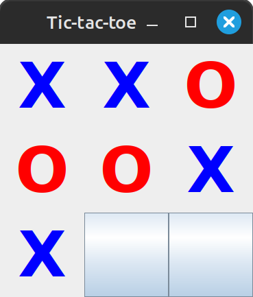
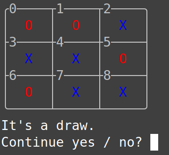

# Tic-tac-toe
[](https://www.gnu.org/licenses/gpl-3.0)

## Description
It's the game that needs no introduction, yet has no play value whatsoever.
It's solved and the result is a draw, if no player makes a mistake.
However, this game is a good way to learn various aspects of programming
and with this project I'm trying to provide a good implementation of the MVC pattern and the Minimax algorithm.
I hope this project will be of some interest to novice developers.

## Getting Started
These instructions will get you a copy of the project up and running on your local machine.

### Prerequisites
* Java 21
* Maven 3.9.5 (an older version might also do the trick)
* Git 2.34.1 (an older version might also do the trick)

### Installing and running
* Clone the repository from GitHub:
```shell
git clone https://github.com/Achaaab/tic-tac-toe.git
```
* Compile
```shell
cd tic-tac-toe
mvn package
```
* Run
```shell
java -jar target/tic-tac-toe-0.0.0.jar s ch
```
### Program arguments
1. View type
   * `s` Swing
   * `t` Terminal
2. Mode
   * `cc` Computer vs. Computer
   * `ch` Human vs. Computer
   * `hh` Human vs. Human

### Screenshots

#### Swing


UI should automatically scale based on screen resolution.

#### Terminal


Terminal view requires support for following ANSI escape codes:
- `ESC[2J` Clears the whole screen.
- `ESC[2K` Clears the current line.
- `ESC[38;2;⟨r⟩;⟨g⟩;⟨b⟩` Selects RGB foreground color (24 bits).
- `ESC[0m` Resets color parameters.
- `ESC[⟨n⟩;⟨m⟩f` Moves the cursor to row n, column m.
- `ESC[A` Moves the cursor 1 cell up.

## Authors
* **Jonathan Guéhenneux** - *Programmer* - [Achaaab](https://github.com/Achaaab)

## License
This project is licensed under the GNU General Public License (GPL) - see the [LICENSE.md](LICENSE.md) for the details.